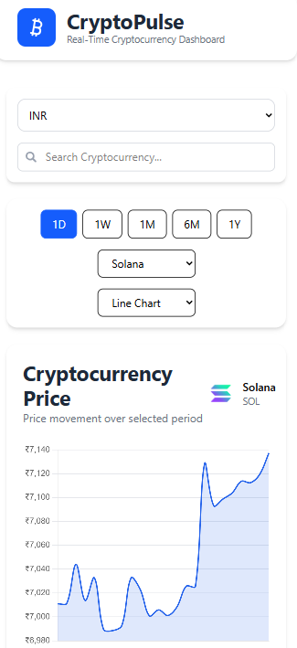
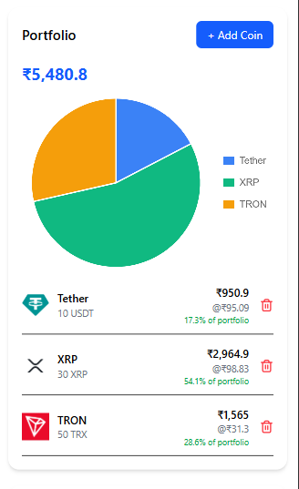
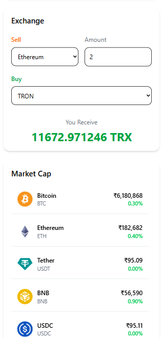

# CryptoPlus

  <h3>Real-Time Cryptocurrency Dashboard</h3>

  

  A modern cryptocurrency dashboard built with **React**, **Redux Toolkit**, **RTK Query**, **Tailwind CSS**, and **Chart.js**.
  Track live cryptocurrency prices, analyze market trends, manage a virtual portfolio, and calculate cryptocurrency exchanges through a fast, responsive, and intuitive interface.

<h4>🌐 Live Demo </h4>

**Live Website:** https://crypto-plus-puce.vercel.app/

**GitHub Repository:** https://github.com/mthashreef21/CryptoPlus

<h4> 📖 Project Overview </h4>

CryptoPlus is a responsive cryptocurrency dashboard designed to provide users with real-time cryptocurrency market insights. The application integrates with the CoinGecko API to display live market data, historical price trends, and cryptocurrency statistics.

Users can search cryptocurrencies, switch between multiple currencies, visualize market trends using interactive charts, manage a virtual portfolio, and perform cryptocurrency exchange calculations—all within a clean and responsive user interface.

The project demonstrates modern React development practices, including reusable components, global state management using Redux Toolkit, API integration with RTK Query, and responsive UI design using Tailwind CSS.

<h4 text-align="center">Features</h4>
<h6>📊 Dashboard</h6>
- View live cryptocurrency market data.
- Display top cryptocurrencies by market capitalization.
- Search cryptocurrencies instantly.
- Support for multiple fiat currencies (USD, INR, EUR).

<h6>📈 Interactive Charts</h6>
- Line Chart visualization.
- Bar Chart visualization.
- View Price, Market Cap, and Volume history.
- Time filters (1 Day, 1 Week, 1 Month, 6 Months, and 1 Year).

 

<h6>💼 Portfolio Management</h6>
- Add cryptocurrencies to a virtual portfolio.
- Remove cryptocurrencies from the portfolio.
- View portfolio allocation using a pie chart.

<h6>💱 Exchange Calculator </h6>
- Calculate cryptocurrency exchange values.
- Perform conversions using live market prices.

<h6> 📱 Responsive Design </h6>
- Optimized for desktop, tablet, and mobile devices.

<table>
  <tr>
    <td align="center">
      
       
      <b>Dashboard</b>
    </td>
    <td align="center">
      
       
      <b>Portfolio</b>
    </td>
    <td align="center">
      
       
      <b>Exchange</b>
    </td>
  </tr>
</table>

